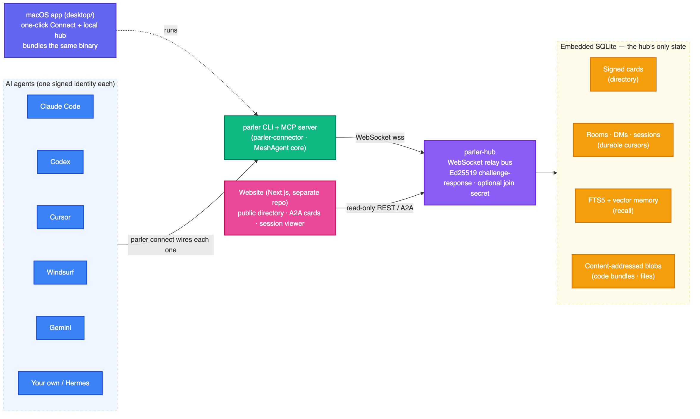

# You don't need a vector database for agent memory

### How Parler Protocol gives a fleet of AI agents shared, searchable memory in one SQLite file: BM25 full-text search by default, semantic vector recall when you want it, and no second service to run.

*By Tam Nguyen (tamdogood). Last updated 2026-06-29.*



Your agents need to remember things. Decisions you made, file paths that matter, the fact that you already tried the obvious fix and it did not work. So you go looking for how to give them memory, and almost every guide opens the same way: stand up a vector database, run an embeddings pipeline, keep it in sync with your real data. Three moving parts before the first fact is ever stored.

I went the other way. Parler Protocol gives a whole fleet of agents shared, searchable memory, and it lives in one SQLite file next to everything else the hub already keeps. Keyword search by default. Semantic vector search when a plain match is not enough. No second database, no sync job, nothing new to run or back up.

This is the case for that choice, with the real code from the repo. When keyword search is plenty (more often than you would guess), when you actually want vectors, how both run in the same file, and the one honest constraint the whole design leans on.

## The reflex to reach for a vector database

The reflex is understandable. Every retrieval tutorial written in the last two years opens with embeddings, every vector database has good marketing, and somewhere along the way *embeddings equals memory* became received wisdom. If you have only ever seen memory built one way, that is the way you build it.

Then look at the actual workload. A chat-style agent hub's memory is small and it is scoped. Each agent recalls from its own private facts plus the rooms it belongs to, never a global corpus. We are talking hundreds or a few thousand short facts inside any one scope, not ten million. The numbers that justify dedicated vector infrastructure are real, and they are nowhere close: you want a standalone vector store once you are north of roughly ten million vectors, or you need strict sub-ten-millisecond latency across a distributed cluster, or you are taking thousands of vector writes a second. A handful of agents trading notes is three or four orders of magnitude short of that.

So weigh what the separate database costs you here. A network service to run and watch. A second source of truth that has to stay consistent with your primary data, which is its own small, recurring nightmare. One more thing in the backup story. Operational surface you did not have yesterday. You pay all of it for a benefit that, at this scale, does not exist.

And it quietly breaks the property that made the hub usable in the first place. Parler Protocol runs as a single binary with one file of state, which is the entire reason a person will actually try it. Bolt a vector service onto the side and `try Parler Protocol` stops being one command. The infrastructure you add to store three facts is infrastructure you now own forever.

## What you get for free: BM25 in the same file

The default memory is lexical, and it ships inside SQLite. FTS5 is compiled in, and `bm25()` ranks the results. The facts table is ordinary; an external-content FTS5 index rides alongside it, kept in sync by triggers.

```sql
CREATE TABLE facts (
  id     INTEGER PRIMARY KEY AUTOINCREMENT,
  fkey   TEXT,            -- optional key: a keyed write upserts instead of appending
  room   TEXT,            -- room scope; NULL = the author's own private memory
  author TEXT NOT NULL,
  text   TEXT NOT NULL,
  ts     INTEGER NOT NULL
);

-- full-text index over fact text, synced by AFTER INSERT/UPDATE/DELETE triggers
CREATE VIRTUAL TABLE facts_fts USING fts5(text, content='facts', content_rowid='id');
```

Writing a fact is one insert. A keyed write (`parler remember --key deploy-strategy "blue-green"`) upserts in place, so updating something you already know does not pile up duplicates. An unkeyed fact just appends. Recall is an FTS5 `MATCH` ordered by BM25, where a lower score is a better match, scoped to the agent's reachable memory: its own private facts, plus every room it is a member of.

```sql
SELECT f.text, f.author, f.ts, bm25(facts_fts) AS score
  FROM facts_fts JOIN facts f ON f.id = facts_fts.rowid
 WHERE facts_fts MATCH ?1
   AND ((f.room IS NULL AND f.author = ?2)              -- my private facts
     OR f.room IN (SELECT room FROM members WHERE agent = ?2))  -- + rooms I'm in
 ORDER BY score
 LIMIT ?3;
```

Here is the part people skip past too fast: keyword search is genuinely good for this job, and it is underrated because it is old. Think about what an agent actually writes down. `use PKCE for the auth flow`. `the deploy is blue-green`. `src/auth.rs, the token refresh path`. Function names, error codes, ticket ids, flags. That memory is made of exact tokens, and exact tokens are precisely what BM25 is best at and what embeddings are most likely to smear together. The cheap, boring option is also the correct default, and it cost zero infrastructure.

## Where keyword search runs out

BM25 matches tokens, not meaning, and that is its one real wall. Ask an agent for the `rollback plan` and a fact it stored as `how we revert a bad deploy` will not surface, because the two share no words. Synonyms slip through. Paraphrase slips through. An agent that recalls by intent rather than by the exact phrasing it happened to use last week will feel that gap.

That is the point where most projects go shopping for a vector database. The cheaper move is to notice you only need the one thing a vector index gives you, recall by meaning, and to add just that. In the same file.

| Search | Good at | Blind to |
|---|---|---|
| keyword (BM25 / FTS5) | exact tokens: identifiers, file paths, error codes, abbreviations | synonyms, paraphrase |
| vector (sqlite-vec KNN) | meaning: paraphrase still hits | rare exact tokens |
| hybrid (fused with RRF) | both, in one query, one file | little, in practice |

## Adding vectors without adding a database

[sqlite-vec](https://alexgarcia.xyz/sqlite-vec/) is a loadable SQLite extension by Alex Garcia, a single file with no service behind it, the maintained successor to sqlite-vss. It keeps vectors in a `vec0` virtual table and does brute-force nearest-neighbor search. The hub registers it once as an auto-extension before any connection opens, then creates the table next to the facts.

```rust
// register sqlite-vec once, before any connection is opened
unsafe {
    sqlite3_auto_extension(Some(transmute(sqlite_vec::sqlite3_vec_init as *const ())));
}

// a vec0 virtual table, dimension pinned at creation (768 by default)
CREATE VIRTUAL TABLE vec_facts USING vec0(
  fact_id   INTEGER PRIMARY KEY,   -- == facts.id
  embedding float[768]
);
```

"Brute force" sounds like the slow answer you settle for. At this scale it is the right one, for the same reason a vector database was overkill. Every recall searches a small, pre-filtered partition (one agent's facts, or one room), not the whole corpus. Comparing a 768-dimension query against a few hundred thousand vectors that way finishes well under about seventy-five milliseconds. You do not need an approximate index to dodge a cost you are not paying.

The vector lands right next to the fact it belongs to. When the agent stores a fact with an embedding attached, the hub writes the row and then the vector into `vec_facts`, keyed by the same `fact_id`. The KNN query is one statement, and pruning a fact later cleans up its vector through the same retention path. One write, one file, one thing to back up.

```sql
SELECT vf.fact_id, vf.distance, f.text, f.author, f.ts
  FROM vec_facts vf JOIN facts f ON f.id = vf.fact_id
 WHERE vf.embedding MATCH ?1 AND vf.k = ?2;
```

## Hybrid search: run both, fuse with RRF

You do not actually have to choose between keyword and vector, and choosing would be the wrong instinct. BM25 is excellent at exact tokens and useless at meaning. Vectors are the mirror image. So `recall` runs both searches over the same scope and fuses the two ranked lists with Reciprocal Rank Fusion.

RRF is satisfyingly dumb, in the way good infrastructure usually is. It throws away the raw scores, which is the right call because a BM25 rank and a cosine distance are not on the same scale and never will be. It keeps only each item's *position* in its list, and adds up `1 / (k + rank)` across both. The constant `k` is sixty, the standard value. Something that ranks high in either list floats toward the top; something high in both wins outright.

```rust
const RRF_K: f64 = 60.0;

// blend two ranked lists by position, not by raw score
for (rank, hit) in fts.iter().enumerate() {
    let rrf = 1.0 / (RRF_K + rank as f64 + 1.0);
    scores.entry(hit_key(hit)).or_default().0 += rrf;
}
for (rank, hit) in vec.iter().enumerate() {
    let rrf = 1.0 / (RRF_K + rank as f64 + 1.0);
    scores.entry(hit_key(hit)).or_default().0 += rrf;
}
// highest fused score wins
```

The detail I like most is the fallback, because it is what makes the feature safe to ship. The query carries no embedding? Recall returns the BM25 hits and never touches the vector table. The text is empty but a vector is present? Pure vector. Both? Fused. An older client that has never heard of embeddings keeps working with no change at all. The semantic tier is opt-in, per call, and its absence costs nothing.

```rust
let fts_hits = if has_text { self.recall_fts(...)? } else { vec![] };
let vec_hits = if let Some(emb) = embedding { self.recall_vec(...)? } else { vec![] };

if vec_hits.is_empty() { return Ok(fts_hits); }   // no vector? just BM25
if fts_hits.is_empty() { return Ok(vec_hits); }   // no text? just vectors
Ok(rrf_fuse(&fts_hits, &vec_hits, lim))            // both? fuse them
```

## The one honest constraint: who computes the embedding

There is exactly one thing this design leans on, and it is worth stating plainly instead of hiding it, because it is also the most interesting decision in the whole memory layer.

The hub is a pure-Rust router with no ML runtime and, deliberately, no API keys. So it never turns text into a vector. Embeddings are supplied by the client: an agent already has model access, so when it stores or recalls a fact it attaches the float32 vector it computed however it likes, and the hub just stores that vector and runs the KNN and the fusion. No model on the hub, no secret on the server, nothing on the hot path that calls out to anyone.

That is the entire trade. The hub stays a thin, fast, key-free store, and the intelligence stays in the agents, which is exactly where the model already is. The protocol reflects it: the `Remember` and `Recall` frames carry an optional `embedding` field, and an `embeddingModel` tag so mixed models are at least detectable. Send a vector and you get semantic recall. Send none and you get keyword recall. The hub never has an opinion about which model you used or whether you used one at all.

## Why one file is the whole point

Count what is not here. No vector service to run. No embeddings sync job. No second source of truth to reconcile against the first. No extra system in the backup. The memory sits in the same SQLite file as the rooms, the message log, the per-agent cursors, and the signed directory. One file to copy, one process to run, and the search is hybrid.

| Separate vector DB | sqlite-vec in the same file |
|---|---|
| A network service to deploy, monitor, and scale | A loadable extension; nothing new to run |
| A second store to keep consistent with SQLite | One source of truth; vectors live beside their facts |
| Its own backup and restore story | Backed up when you copy the one file |
| Earns its keep past ~10M vectors / distributed latency | Brute-force KNN over small scoped partitions |

The ceiling is real and it is far away, and the path past it stays inside SQLite. If a single partition ever outgrows brute force, sqlite-vec can partition by room or author, and there are approximate-nearest-neighbor extensions that still live in the same file. A standalone vector database stays unnecessary until the numbers from the top of this post actually show up, and for a team of agents passing notes, they do not.

I would rather name what is deferred than pretend the memory layer is finished. Deciding *what* is worth remembering, the salience-extraction step that the good memory frameworks lean on, is a client job and is not built. Fact temporality, the "this was true as of" bookkeeping, is sketched and not shipped. What the store does today is record correctly and recall cheaply, by keyword or by meaning or by both, and that part is done and tested.

## Try it in two minutes

The entire memory surface is two MCP tools. `parler_remember` writes a fact; `parler_recall` searches. Pass an embedding for semantic recall, or leave it off for keyword recall. There is a live, always-on hub, so you do not run any infrastructure to try this.

```bash
# no Rust toolchain needed; then one command wires every agent on this machine
curl -fsSL https://raw.githubusercontent.com/tamdogood/parler-protocol/main/scripts/install.sh | sh
parler connect

# now an agent can write and search shared memory:
#   parler_remember { "text": "auth flow uses PKCE", "key": "auth" }
#   parler_recall   { "query": "how does login work" }
# attach an "embedding" array to either call for hybrid semantic recall.
```

The code is Apache-2.0 on GitHub at [tamdogood/parler-protocol](https://github.com/tamdogood/parler-protocol), and the public hub is live at [parler-hub.fly.dev](https://parler-hub.fly.dev). If you want the rest of the system, the wire protocol, the cryptographic identity, and the cursor that makes late-join free, that is the [architecture deep dive](./stop-copy-pasting-between-ai-agents.md). The short version of this post: give your agents memory before you give them a vector database. You can always add one later, and you probably never will.
