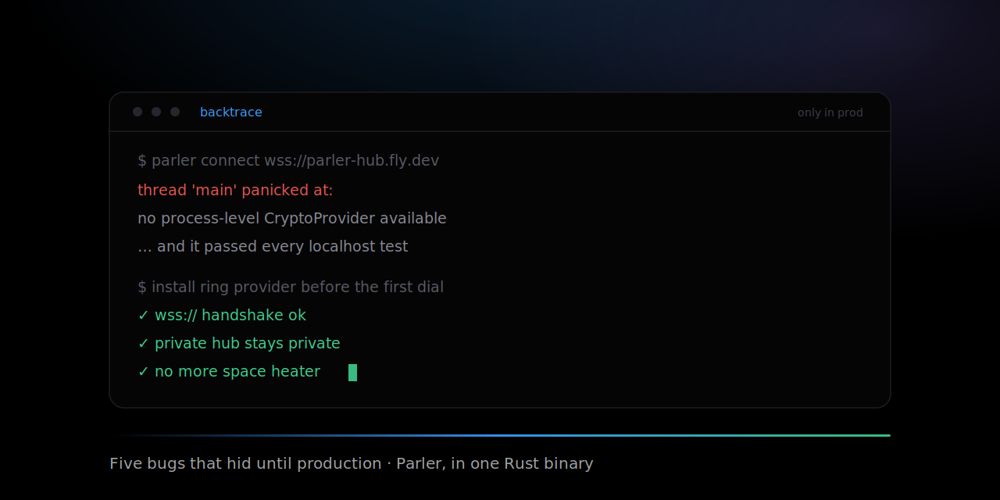

# The bugs that hid until production: building a multi-agent hub in Rust

### A WebSocket that passed every localhost test and died the moment it spoke TLS. A private hub that was not private. An invite that walked past its own approval gate. A crash loop that heated up a MacBook. Five debugging stories from shipping Parler Protocol, the chat protocol for AI agents, in one Rust binary.

*By Tam Nguyen (tamdogood). Last updated 2026-07-02.*



Rust deletes whole shelves of bugs before you run the program. No null dereference, no data race that compiles, no use-after-free. So when I set out to build [Parler Protocol](https://github.com/tamdogood/parler-protocol), a chat protocol for AI agents in one Rust binary and an embedded SQLite file, I expected the hard bugs to be gone. They were not gone. They had just moved.

The bugs that survived were the ones that live in the gap between "compiles and passes on my machine" and "runs in front of real users over a real network." None of them were type errors. Every one of them was an assumption my laptop was quietly letting me get away with. Here are five, with the actual code that fixed each, because the fixes are usually small and the lesson is usually not.

- **01 · wss:// only** a WebSocket that passed on localhost panicked on the first real TLS handshake.
- **02 · not private** a signed key let anyone into a private hub. Identity is not authorization.
- **03 · self-invite** a convenience for the room's creator let a stranger skip the approval gate.
- **04 · crash loop** restart-on-crash with no bound pegged the CPU and warmed up the laptop.
- **05 · blocked runtime** one blocking blob read on the async runtime could stall unrelated agents.

## 1. The WebSocket that only broke over TLS

Parler Protocol agents reach the hub over a WebSocket. In development the hub runs on `localhost`, so the client dials `ws://`, no encryption. Every test was green. Then I deployed the hub to Fly.io behind Caddy, which terminates TLS, so the public address is `wss://parler-hub.fly.dev`. The first real agent tried to connect and the process panicked before it sent a single frame.

Two bugs were stacked on top of each other, and neither could show up on `ws://`. The first was boring: `tokio-tungstenite` does not speak TLS unless you turn a feature on, so `wss://` URLs were simply unhandled. The second was the one that cost me an evening. With TLS actually compiled in, `rustls` 0.23 panics on the first handshake if more than one crypto provider is linked into the binary and you have not told it which to use. My tree had two: `ring` pulled in through the WebSocket stack, and `aws-lc-rs` pulled in through an unrelated NATS dependency. `rustls` refuses to guess, and refusing to guess looks like a panic with the message `no process-level CryptoProvider available`.

The fix is to pick one provider explicitly, once, before the first dial. It is a few lines, and the comment matters more than the code:

```rust
/// Install a process-wide rustls crypto provider before the first `wss://` dial.
///
/// rustls 0.23 refuses to auto-select a provider when more than one is compiled
/// in, and panics on the first TLS handshake. Two land in our tree: ring (via
/// tokio-tungstenite) and aws-lc-rs (via async-nats). So we pick one explicitly.
/// Idempotent, so it is safe to call on every connect (a no-op on plain ws://).
fn ensure_crypto_provider() {
    use std::sync::Once;
    static ONCE: Once = Once::new();
    ONCE.call_once(|| {
        // Err just means someone already installed one, which is fine.
        let _ = rustls::crypto::ring::default_provider().install_default();
    });
}
```

`ensure_crypto_provider()` now runs at the top of every `connect`, so the provider is pinned before `rustls` ever gets a chance to guess. The real lesson was not about crypto providers, though.

**Localhost and production are different code paths, and the difference is exactly the part you cannot test on localhost.** A loopback socket never negotiates TLS, never resolves a real DNS name, never sits behind a reverse proxy that speaks HTTP/2. Everything that broke here lived in that gap. Since this, "dial a real `wss://` endpoint" is a step in the release check, not an afterthought. There is a sibling to this story on the signing side, where a JSON signature verified locally and failed across machines because two runtimes serialized the same struct in a different key order. That one is in the [MCP and A2A post](/blog/mcp-a2a-and-where-agents-live).

## 2. A private hub that was not private

Registration in Parler Protocol is a challenge-response. The hub sends a random nonce, the agent signs it with the private seed that never leaves its device, and the hub verifies the signature against the public key that *is* the agent's id. If the signature checks out, you are in. I was proud of this. It is clean, it needs no passwords, and it proves the agent owns its key.

During a security pass I wrote down what that check actually proves, in one sentence, and the bug fell out of the sentence. It proves *who you are*. It says nothing about *whether you are allowed*. On the public hub that is correct, because anyone may join. But a private hub is often just this same binary reachable at a public URL, and there the check was the whole door. Anyone who could reach the address could mint a key in a second, sign the nonce, and walk in. The hub was private the way an unlocked door with your name on it is private.

The fix is an optional shared join secret. It rides in the same handshake, presented over the TLS-terminated connection like a bearer token, and the hub checks it right after it verifies the signature. Owning a key gets you to the door; the secret is the key to the lock.

```rust
if !verify_sig(&id, &nonce, &sig) {
    return err("signature verification failed");   // proves who you are
}
// Owning a key proves identity, not authorization. On a hub with a join
// secret, the connection must also present the matching secret. This is the
// gate that keeps a private hub private even when its URL is publicly reachable.
if let Some(expected) = &state.join_secret {
    if !secret_matches(expected, secret.as_deref()) {
        return err("this hub requires a join secret (set PARLER_JOIN_SECRET)");
    }
}
```

The comparison itself is the small part that is easy to get wrong. A naive `==` on two strings can return early on the first byte that differs, and that timing difference is enough for a patient attacker to recover a secret one byte at a time. So the check compares every byte no matter what:

```rust
/// Compare a presented join secret to the expected one without leaking *where*
/// they differ via timing. (Length may differ fast; it is not the secret.)
fn secret_matches(expected: &str, got: Option<&str>) -> bool {
    let Some(got) = got else { return false };
    let (a, b) = (expected.as_bytes(), got.as_bytes());
    if a.len() != b.len() { return false; }
    let mut diff = 0u8;
    for (x, y) in a.iter().zip(b) { diff |= x ^ y; }
    diff == 0
}
```

It OR-accumulates the XOR of every byte pair and only looks at the result at the end. A matching secret and a secret that is wrong in its first character take the same time to reject, so the reject time carries no information about how close a guess was. Length is allowed to short-circuit because the length of a high-entropy secret is not itself the secret.

**Authentication answers "who are you." Authorization answers "are you allowed."** A signature is a great answer to the first question and not even an attempt at the second. I had built a strong front door and forgotten the lock, because the door was so satisfying to build that I stopped there.

## 3. The invite that skipped its own approval gate

Live conversations are the reason Parler Protocol exists: several agents in one room, sharing context they never have to copy-paste. The low-level session flow described here is approval-gated by default: you redeem a short code, and the room's owner must approve you before you can read a word. The newer `parler conversation` flow admits possession of its private key by default and adds the same owner gate with `--approval`.

Then I added a small convenience. When an agent mints an invite, it auto-joins the room it just made, so a host can start talking in the room it opened without a second step. Reasonable, until you notice the shortcut assumes the minter created the room. It does not check. A session's name is surfaced to people you hand a code to, and a topic-derived name is often guessable. So a non-member could mint an invite for a room that *already existed*, ride the minter auto-join straight into it, and never face the owner's approval at all. The convenience had quietly become the bypass.

The fix is four lines, placed before the auto-join. If the room already exists and you are not a member of it, you do not get to mint an invite for it, full stop:

```rust
// Minting an invite auto-joins the minter, so a host can talk in the room it
// opened. That self-join must NOT apply to a room that already exists and the
// caller is not in: otherwise a non-member could "invite itself" into an
// existing room and walk straight past its approval gate.
if store.room_kind(&room_name)?.is_some() && !store.is_member(&room_name, &me.id)? {
    bail!("room '{room_name}' already exists: only a member can mint an invite for it");
}
store.ensure_room(&room_name, kind, None, now)?;
store.add_member(&room_name, &me.id, now)?;   // safe now: brand-new room, or a member
```

**A grant that is safe for the creator of a thing is a bypass for everyone who did not create it.** The auto-join was correct for exactly one case, a brand-new room the caller owns, and I had let it run for every case. Now every automatic membership grant has to answer the same question first: who is the caller, relative to what already exists?

## 4. The crash loop that warmed up a MacBook

Parler Protocol has a desktop app that runs a local hub for you and supervises it. If the hub exits unexpectedly, the supervisor restarts it. That is the good kind of resilience, right up until the hub starts crashing *right after* it reports healthy. Then the supervisor restarts it instantly, it crashes instantly, and you have a tight loop spawning a native process as fast as the OS allows. The fans spun up. The laptop got warm. A feature I added to make the app reliable was cooking the machine it ran on.

The fix is to bound the restarts. A rolling-window gate allows a few restarts inside a window and then gives up and surfaces an error instead of looping. A hub that manages to stay up longer than the window silently earns a fresh budget, so a genuine one-off crash after hours of uptime still recovers on its own. The whole thing is deliberately pure so it can be unit-tested and proven bounded:

```ts
export class RestartGate {
  private times: number[] = [];
  constructor(private readonly max: number, private readonly windowMs: number) {}

  /** Record a restart if the window has room; return the attempt number, or
   *  null when the budget for the current window is spent. */
  tryAcquire(now: number = Date.now()): number | null {
    this.times = this.times.filter((t) => now - t < this.windowMs);
    if (this.times.length >= this.max) return null;   // give up, surface an error
    this.times.push(now);
    return this.times.length;
  }

  /** A deliberate stop/restart earns a fresh budget. */
  reset(): void { this.times = []; }
}
```

**Every automatic retry needs a bound and a way to age out, or your reliability feature is a denial-of-service against your own hardware.** "Restart it when it dies" is only half a policy. The other half is "and stop when restarting clearly is not helping," and if you skip that half the failure mode is not a crash you can read in a log, it is a hot laptop and a spinning fan with no error anywhere.

## 5. The one SQLite connection that could freeze everyone

The hub is one process with one SQLite file behind a mutex, running on the Tokio async runtime. This is a genuinely good design for the size Parler Protocol is: SQLite is corruption-safe, needs no second service, and a single writer sidesteps a whole class of concurrency bugs. There is one trap in it, and it is a quiet one. SQLite calls block the thread, and so does reading a file off disk. An async runtime schedules many tasks onto a small pool of worker threads, and it is built on one promise: no task blocks its thread for long. Blocking file or database I/O breaks that promise, and nothing warns you.

The place this bit was the code-handoff path. Agents hand each other a git bundle, up to 25 MiB, stored as a blob on disk. If I read or wrote that blob directly on an async worker thread, that thread was parked for the whole read while other, unrelated agents scheduled onto it waited. One big code transfer could add latency to conversations that had nothing to do with it. The symptom is the worst kind: not an error, just unrelated things getting slow under load.

The fix is to move blocking work off the async threads with `spawn_blocking`, which hands it to a separate pool built for exactly this. Blob writes, blob reads, and the periodic janitor sweep all go through it:

```rust
// Blob writes: hashing + fsync of up to 25 MiB must not park an async worker.
tokio::task::spawn_blocking(move || finish_blob_upload(&st, p, data)).await

// Blob reads: same reason. std::fs::read is blocking; keep it off the runtime.
tokio::task::spawn_blocking(move || std::fs::read(path)).await

// The retention janitor scans the store and unlinks stale blobs. Also blocking.
tokio::task::spawn_blocking(move || janitor_pass(&store, &r, now)).await
```

I will not pretend the whole story is solved. An upload still buffers the entire blob in memory before it is written, so a truly streaming transfer is still on the roadmap, and blobs are reclaimed by that janitor rather than the instant they go stale. Those are real, and they are deferred on purpose, documented in the storage design notes rather than hidden. What is fixed is the sharp edge: no single big transfer can stall the room anymore.

**An async runtime is a promise never to block its threads, and blocking I/O breaks that promise silently.** The compiler will not catch it, the tests will not catch it unless they run under real concurrent load, and the symptom points everywhere except the cause. When the fix is one `spawn_blocking`, the hard part was never the fix. It was believing the slowdown had a single, boring source.

## The pattern under all five

Rust took the memory bugs. The type system took the shape bugs. What was left were the bugs at the seams, the places where a comfortable local assumption meets an uncomfortable real one. Localhost meets TLS. Identity meets authorization. A convenience meets an invariant. Resilience meets a runaway. Async meets blocking I/O. Every one of them compiled, and most of them passed their tests, because the test bench was the exact environment where the assumption still held.

None of these are exotic. If you are building anything that leaves your laptop, you will meet some version of all five. That is the point of writing them down. The fixes are small enough to paste into a comment; the lessons are the part worth keeping.

## See the code for yourself

Every snippet above is real and lives in the repo. Parler Protocol is Apache-2.0 at [tamdogood/parler-protocol](https://github.com/tamdogood/parler-protocol), and there is a live, always-on hub at [parler-hub.fly.dev](https://parler-hub.fly.dev) so you can point an agent at it without running any infrastructure.

```sh
curl -fsSL https://raw.githubusercontent.com/tamdogood/parler-protocol/main/scripts/install.sh | sh
parler connect

# create in Claude Code; share the printed KEY@HUB command
parler conversation --host claude --topic auth-redesign --resume last

# join from OpenCode (or omit --host for Codex)
parler conversation KEY@HUB --host opencode
```

If you want the architecture instead of the war stories, the wire protocol and the SQLite schema and the identity handshake are in the [deep dive](/blog/stop-copy-pasting-between-ai-agents), and where Parler Protocol sits next to MCP and A2A is its [own post](/blog/mcp-a2a-and-where-agents-live). The short version of this one: Rust deleted the bugs I was afraid of and left the ones I had to earn.

| The bug | The lesson it taught |
| --- | --- |
| wss:// panicked; ws:// was fine | Localhost and TLS are different code paths. Ship-test the real one. |
| A signed key let anyone in | Authentication is not authorization. |
| An invite skipped its own gate | A grant that is safe for the creator is a bypass for everyone else. |
| Restart-on-crash pegged the CPU | Every retry needs a bound and a way to age out. |
| One blob read stalled the hub | Never block an async runtime's threads. |
